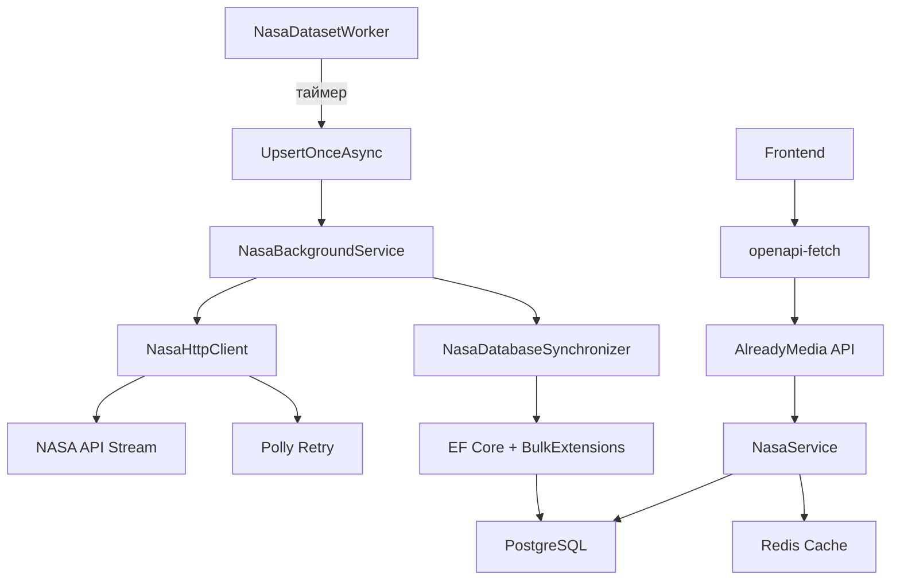

# NASA Meteorite Landings Service

**Обновлённый README** с учётом новых фич и архитектурных улучшений

---

## Особенности

- **Асинхронная потоковая синхронизация** с NASA API в батчах (`batchSize=900`)
- **Резилиентный HTTP-клиент** с экспоненциальной политикой retry (Polly)
- **Эффективный Bulk-Upsert** через `EFCore.BulkExtensions` с потоковой обработкой
- **Транзакционная целостность** данных при синхронизации
- **Защита от перекрытия задач** через `SemaphoreSlim` в `BackgroundService`
- **Кеширование API-ответов** с Redis + автоматическая инвалидация
- **Гибкая фильтрация и группировка** по годам с агрегацией (количество, средняя масса)
- **Пагинация на уровне БД** с точным подсчётом страниц
- **Автоматическая генерация OpenAPI-клиента** для фронтенда
- **Docker Compose + Health Checks** для отказоустойчивости

---

## Архитектура

---

## Технологии

Backend

- .NET 9
- Entity Framework Core + EFCore.BulkExtensions
- PostgreSQL
- Redis
- Polly

Frontend

- React 18 + Vite
- Tanstack Query
- Tanstack Table
- openapi-fetch (генерация типов из OpenAPI)
- Shadcn UI + Tailwind CSS

---

## Особенности проекта

| Фича | Описание                                                                         |
|------|----------------------------------------------------------------------------------|
| **Потоковая обработка JSON** | Чтение NASA API как `AsyncEnumerable` без полной загрузки в память               |
| **Батчинг данных** | Обработка по `900`  записей (настраиваемо) за раз для оптимальной нагрузки на БД |
| **Bulk InsertOrUpdate** | Использование `EFCore.BulkExtensions` вместо `INSERT ... ON CONFLICT`            |
| **Точная статистика изменений** | Подсчёт: `+добавлено`, `-удалено`, `±обновлено`                                  |
| **Транзакционная целостность** | Полная синхронизация в одной транзакции с откатом при ошибке                     |
| **Защита от перекрытия задач** | `SemaphoreSlim` предотвращает параллельные запуски `BackgroundService`           |
| **Экспоненциальный retry** | Polly с бэкоффами `2s → 4s → 8s` при сбоях сети/таймаутах                        |
| **Потоковый Bulk-Upsert** | `EnableStreaming = true` — минимальное потребление памяти при больших датасетах  |
